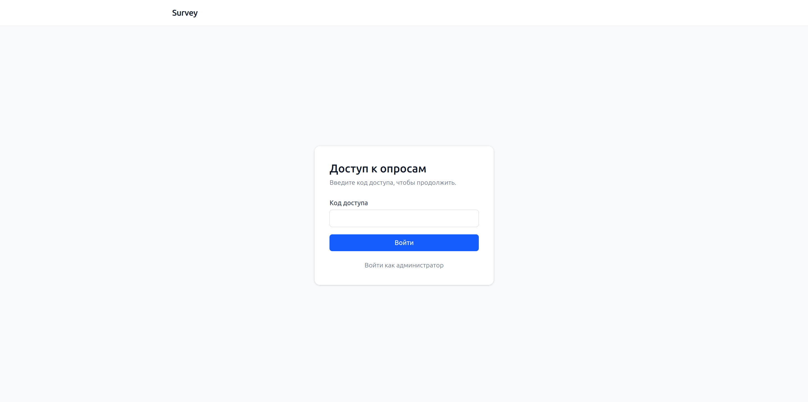
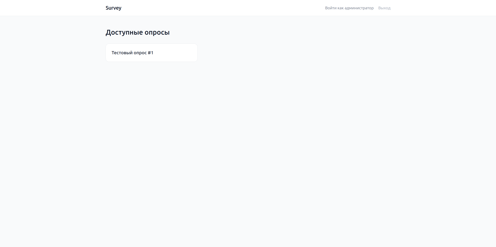
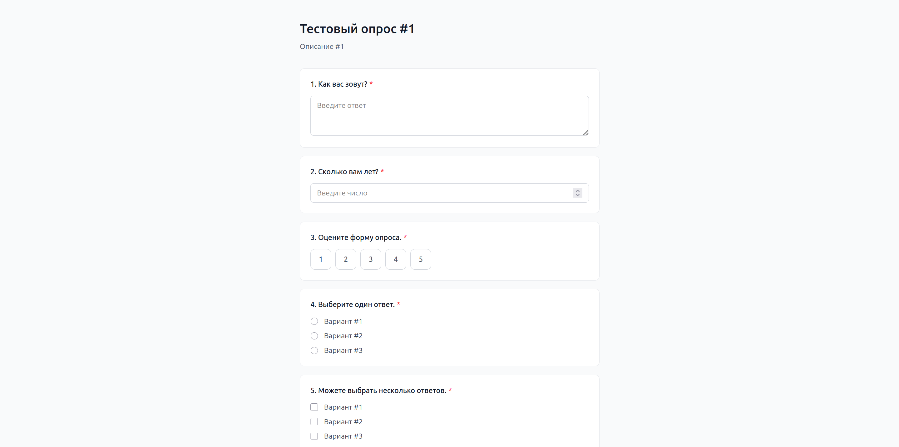
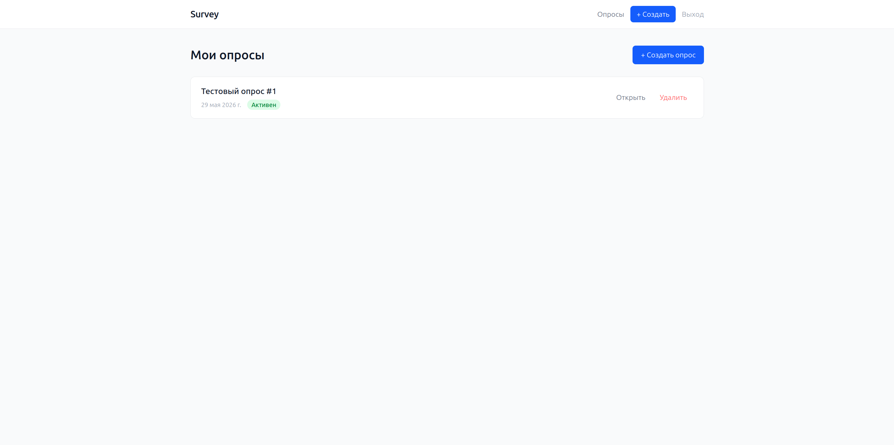
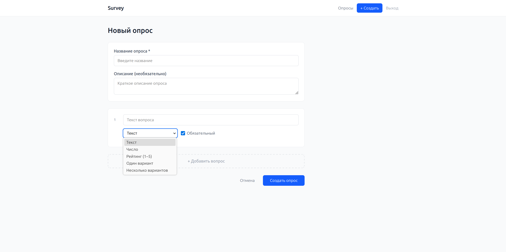
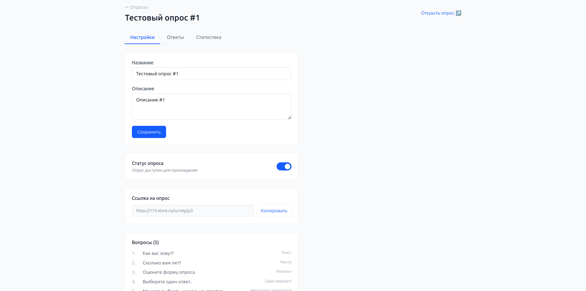
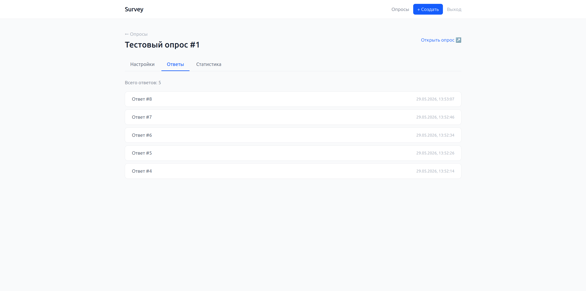
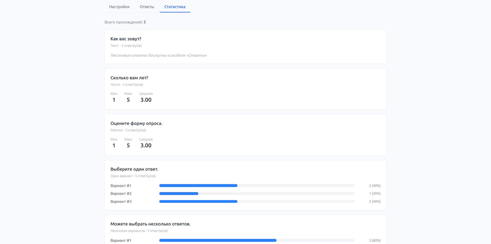

# Survey Platform

Платформа для создания опросов. Администратор создаёт и управляет опросами,
пользователи проходят их по коду доступа (без персонального аккаунта). Под капотом —
статистика по количественным вопросам и просмотр отдельных прохождений.

## Интерфейс

### Для пользователей

**Ввод кода доступа**



**Список доступных опросов**



**Прохождение опроса**



### Для администратора

**Панель опросов**



**Конструктор опроса**



Просмотр опроса — три вкладки:

**Настройки**



**Ответы**



**Статистика**



## Стек

- **Backend:** FastAPI + SQLAlchemy 2.0 (async) + PostgreSQL 16
- **Frontend:** React 19 + Vite + Tailwind CSS v4
- **Dev:** Docker Compose (hot reload) · **Prod:** Gunicorn + Nginx + Certbot

## Аутентификация

Два общих ключа из `.env`, оба выдают JWT:

- **Администратор** (`ADMIN_SECRET_KEY`) — вход на `/login`, доступ к созданию и
  управлению опросами, просмотру ответов и статистики.
- **Пользователь** (`USER_SECRET_KEY`) — вход на `/enter`, доступ к списку активных
  опросов и их прохождению. Админский токен тоже подходит для прохождения.

Персональных аккаунтов нет — ключи общие на всех.

## Локальный запуск

```bash
cp .env.example .env          # заполнить значения
docker compose up -d
docker compose run --rm web alembic upgrade head
```

- Фронтенд: http://localhost:5173
- API: http://localhost:8000 · Swagger: http://localhost:8000/docs

## Структура

```
app/         FastAPI: модели, схемы, роутеры, auth
alembic/     миграции БД
frontend/    React SPA (Vite)
nginx/       прод-конфиг и Dockerfile (собирает фронт + отдаёт под /survey/)
```

## Деплой

Прод-сборка обслуживается под префиксом `/survey/` (например `https://example.com/survey`).

```bash
docker compose -f docker-compose.prod.yml build --no-cache web nginx
docker compose -f docker-compose.prod.yml up -d
docker compose -f docker-compose.prod.yml run --rm web alembic upgrade head
```

> `.env` и SSL-сертификаты в репозиторий не входят — передаются на сервер отдельно.
